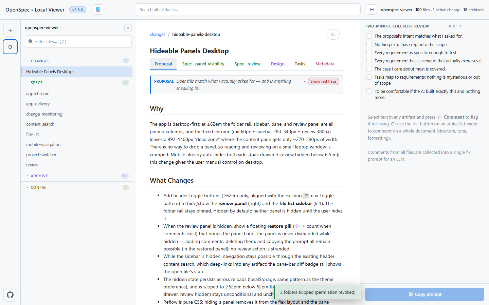

# OpenSpec Local Viewer

An offline-capable, single-page viewer for [OpenSpec](https://openspec.dev/)
artifacts. It uses [Plain Vanilla Web](https://plainvanillaweb.com): no build
step, no framework — plain HTML, CSS, and ES-module JavaScript served as-is.

**Try it live:** https://ypyl.github.io/openspec-viewer/



## What it does

- **Monitor one or more folders**: add as many repository/`openspec/` folders as
  you like from the rail (＋ button); each gets a colored avatar, its own file
  list, tabs, and unread state, and a "live" dot that lights up when a background
  folder has changes. Re-picking the same folder is deduped; closing the active
  folder falls back to another one.
- **Live monitoring** (Chrome/Edge): folders picked via the File System Access
  API are polled every 10 seconds, so added, modified, and deleted artifacts
  appear without reloading. Open files hot-refresh in place.
- **Change diffs**: every scan snapshots artifact content, so when the monitor
  detects a change you get a **Diff** button next to the breadcrumb with +/− line
  counts — click it to switch from the artifact to a line-by-line unified diff
  view (a NEW badge marks diffs you haven't seen yet). Snapshots live in
  IndexedDB, so diffs survive a page reload.
- Open a change to see its artifacts as tabs: Proposal, Spec(s), Design, Tasks, Metadata.
- **Review mode**: select text in an artifact and add a comment, or comment on
  the whole file from the artifact header; highlights are kept per file, then
  collected with the artifact content into a single LLM fix prompt (copy it or
  open it in a new tab). Each artifact kind shows a distilled **Guide** strip,
  and the review panel opens with the official two-minute checklist.
- **Content search**: the header search box is typo-tolerant full-text search
  (Fuse) over the active folder's artifacts, with a grouped results dropdown and
  in-file match highlighting. The sidebar's **Filter files** box narrows the
  current file list.
- Dark and light themes (follows the system unless you override), collapsible
  sidebar sections, and a per-folder unread/read marker.
- Everything reads locally — nothing is uploaded.

## Using it

The app is served over HTTP(S) and loads as ES modules with a service worker, so
it must be opened in a browser rather than from `file://`. Use the hosted version
at https://ypyl.github.io/openspec-viewer/, or install it as an app (install icon
in the address bar) so it runs fully offline.

1. Click the **＋** button in the left rail and choose a repository root or its
   `openspec/` folder.
2. The picker reopens at your last-chosen folder (persisted via IndexedDB).

In browsers without the File System Access API, the folder picker falls back to a
one-shot read without live updates.

## Local development

The app is a static multi-file site with no build step. Serve the folder over HTTP
and open it in a browser:

```
python -m http.server 8743
# then open http://127.0.0.1:8743/
```

## Architecture

- `index.html` — static skeleton (head meta, vendored UMD `<script>` tags,
  pre-paint theme bootstrap, component shells). Version lives in the first-line
  comment.
- `index.js` — bootstrap: registers the web components and starts the app.
- `index.css` — root stylesheet; `@import`s the stylesheets below.
- `styles/` — `reset.css`, `variables.css` (theme tokens), `global.css` (layout).
- `lib/` — vendored libraries: the Plain Vanilla Web libs (html-literal,
  tiny-signals) as ES modules, plus marked, js-yaml, DOMPurify, and Fuse as UMD
  builds loaded off `window`.
- `app/` — logic modules: `state.js` (signals), `store.js` (folder registry +
  IndexedDB + File System + snapshots/scan), `model.js` (pure path/artifact
  classification), `render.js`, `diff.js`, `annotations.js` (review
  highlights/comments), `review-guide.js` (distilled review guidance),
  `search.js` (Fuse content search), `prompt.js` (LLM fix-prompt builder),
  `testbridge.js` (e2e test API exposed on `window`).
- `components/` — web components (`osv-*`), each a folder with `.js` + `.css`:
  header, folder rail, file list, pane (tabs + artifact body), review drawer,
  search, loading overlay, toast.
- `imports.js` — centralizes module loads.
- `sw.js` — service worker (cache-name version tied to the app version).

Keep the version in sync across `index.html` (comment + header badge) and
`sw.js` (`CACHE_VERSION`) when you ship a change.

## Tests

- Node unit tests, zero deps — `npm test` (runs `node --test tools/test-*.mjs`):
  `tools/test-model.mjs`, `tools/test-diff.mjs`, `tools/test-search.mjs`.
- Playwright end-to-end tests against the served app:
  `diff-test.js` (scan → snapshot → diff → render), `migration-test.js`
  (IndexedDB v2→v3 upgrade keeps the saved folder), `multi-folder-test.js`,
  `collapse-test.js`, `archive-read-test.js`, `whole-file-comment-test.js`,
  `review-guidance-test.js`.

Run a browser test with `playwright-cli` against `python -m http.server 8743`.